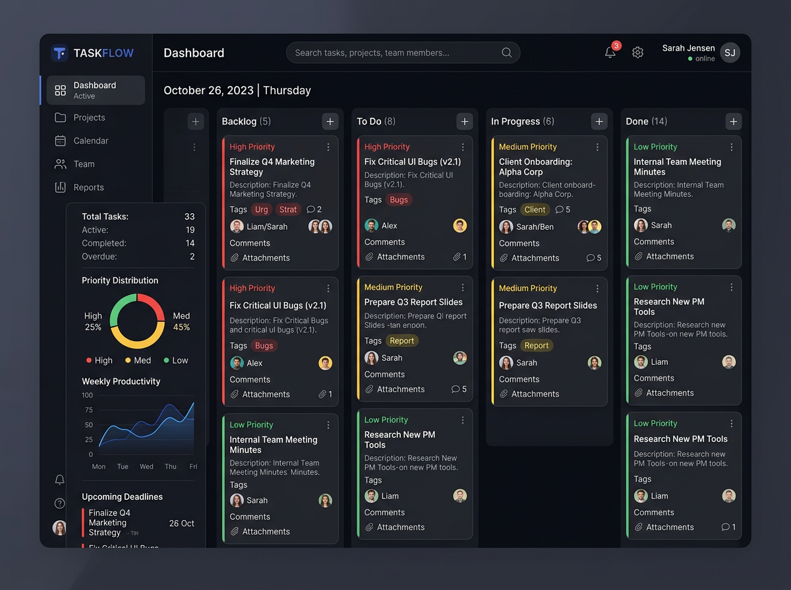
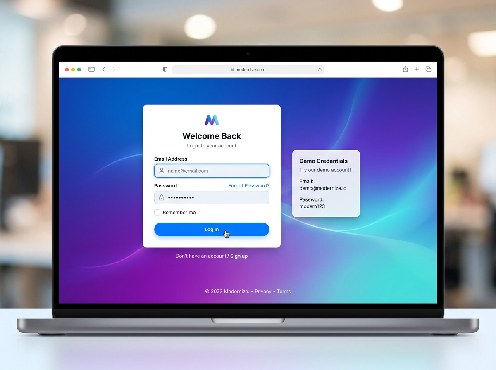

<<<<<<< HEAD
<div align="center">
  
  
  <h1>📋 TaskMaster Pro</h1>
  <p><strong>Enterprise-Grade Task Management System</strong></p>
  
  <p>
    
    
    
    
    
  </p>
</div>

## 🌟 Overview

TaskMaster Pro is a **full-stack MERN application** featuring modern UI/UX design, enterprise-level security, and scalable architecture. Built with cutting-edge technologies for optimal performance and user experience.

### 🎯 Key Highlights

- **🔐 Advanced Security**: JWT authentication with Role-Based Access Control (RBAC)
- **📊 Real-time Monitoring**: System performance dashboard with live metrics
- **📱 Fully Responsive**: Mobile-first design that works on all devices
- **🚀 Containerized**: Docker support for easy deployment
- **🎨 Modern UI**: Beautiful interface with Tailwind CSS and Framer Motion
- **⚡ High Performance**: Optimized for speed and scalability

## 📸 Screenshots

<table>
  <tr>
    <td width="33%">
      <h3>🎯 Dashboard</h3>
      
      <p>Interactive task management with real-time statistics</p>
    </td>
    <td width="33%">
      <h3>🔒 Login Page</h3>
      
      <p>Clean authentication interface with demo credentials</p>
    </td>
    <td width="33%">
      <h3>🖥️ System Monitor</h3>
      
      <p>Admin dashboard with real-time performance metrics</p>
    </td>
  </tr>
  <tr>
    <td colspan="3" align="center">
      <h3>📱 Mobile Responsive</h3>
      
      <p>Fully responsive design that adapts to all screen sizes</p>
    </td>
  </tr>
</table>

## 🚀 Quick Start

### Prerequisites
- **Node.js** 16+
- **MongoDB** (local or Atlas account)
- **Git**

### Installation Steps

1. **Clone the Repository**
```bash
git clone https://github.com/yourusername/taskmaster-pro.git
cd taskmaster-pro
```

2. **Install Dependencies**
```bash
# Frontend
cd frontend && npm install

# Backend  
cd ../backend && npm install
```

3. **Configure Environment**
```bash
# Create backend/.env file:
MONGODB_URI=your_mongodb_connection_string
JWT_SECRET=your_32_character_secret_key_here
PORT=5000
FRONTEND_URL=http://localhost:5173
```

4. **Start Development Servers**
```bash
# Terminal 1 - Backend
cd backend && npm run dev

# Terminal 2 - Frontend
cd frontend && npm run dev
```

5. **Access the Application**
- **Frontend**: http://localhost:5173
- **Backend API**: http://localhost:5000

### 🐳 Docker Alternative

```bash
# One-command deployment
docker-compose up --build

# Access at:
# Frontend: http://localhost:3000
# Backend: http://localhost:5000
# MongoDB Admin: http://localhost:8081
```

## 👥 User Roles & Permissions

| Role | Permissions | Access Level |
|------|-------------|--------------|
| **👤 User** | Create/edit own tasks, dashboard access | Basic |
| **👔 Manager** | All user permissions + reports view | Intermediate |
| **👑 Admin** | Full system access + user management | Advanced |

### Demo Credentials
- **Admin**: `admin@taskmaster.com` / `admin123`
- **User**: `demo@taskmaster.com` / `demo123`

## 🛠️ Technical Architecture

### Frontend Stack
```
React 18 + Vite + Tailwind CSS + Framer Motion
├── State Management: React Context API
├── Routing: React Router DOM
├── Forms: React Hook Form + Zod
├── Charts: Recharts
├── Icons: Lucide React
└── Animations: Framer Motion
```

### Backend Stack
```
Node.js + Express + MongoDB
├── Authentication: JWT + Bcrypt
├── Database: MongoDB + Mongoose
├── Validation: Zod
├── Security: Helmet, CORS, Rate Limiting
└── Monitoring: Custom-built metrics
```

### Deployment Architecture
```
Production Setup
├── Frontend: Vercel/Netlify
├── Backend: Render/Railway
├── Database: MongoDB Atlas
└── Containerization: Docker + Docker Compose
```

## 🎯 Core Features

### 🔧 Task Management
- ✅ Create, read, update, delete tasks
- 📅 Due date management
- ⚡ Priority levels (Low/Medium/High)
- 🔄 Status tracking (Pending/In Progress/Completed)
- 🔍 Advanced search and filtering
- 📱 Drag & drop organization

### 📊 Analytics & Reporting
- 📈 Real-time task statistics
- 🎯 Performance metrics dashboard
- 📊 Task distribution charts
- 🕐 Timeline analysis
- 📋 Export capabilities

### 🔒 Security & Access
- 🔐 JWT-based authentication
- 👥 Role-based access control
- 🔒 Password encryption (bcrypt)
- 🛡️ Input validation and sanitization
- 🚫 Session management

### 🎨 User Experience
- 🌙 Dark/light theme toggle
- 📱 Fully responsive design
- ⚡ Smooth animations
- 🎯 Intuitive interface
- 🚀 Fast loading times

## 📁 Project Structure

```
taskmaster-pro/
├── frontend/
│   ├── public/
│   │   └── images/           # Generated screenshots
│   ├── src/
│   │   ├── components/       # React components
│   │   ├── contexts/         # Auth & state context
│   │   ├── services/         # API services
│   │   └── utils/            # Helper functions
│   └── vite.config.js        # Build configuration
│
├── backend/
│   ├── models/               # Mongoose schemas
│   ├── routes/               # API endpoints
│   ├── middleware/           # Auth & RBAC
│   └── server.js             # Main application
│
├── docker-compose.yml        # Container orchestration
├── API_DOCS.md              # API documentation
├── DEPLOYMENT.md            # Deployment guide
└── README.md                # This file
```

## 🎯 API Endpoints

### Authentication
```
POST   /api/auth/register     # User registration
POST   /api/auth/login        # User login
GET    /api/auth/me           # Get current user
```

### Tasks
```
GET    /api/tasks             # Get all tasks
POST   /api/tasks             # Create new task
PUT    /api/tasks/:id         # Update task
DELETE /api/tasks/:id         # Delete task
```

### System (Admin Only)
```
GET    /api/system/metrics    # Performance metrics
GET    /api/system/users      # User management
```

## 🚀 Deployment Options

### Cloud Deployment (Recommended)

| Platform | Frontend | Backend | Database |
|----------|----------|---------|----------|
| **Vercel + Render** | ✅ | ✅ | MongoDB Atlas |
| **Netlify + Railway** | ✅ | ✅ | MongoDB Atlas |
| **AWS EC2** | ✅ | ✅ | Atlas/DynamoDB |
| **Heroku** | ✅ | ✅ | Atlas/Postgres |

### Local Development
```bash
# Development mode
npm run dev:frontend  # Vite dev server
npm run dev:backend   # Nodemon server

# Production build
npm run build:frontend
npm run start:backend
```

## 🔧 Development Commands

### Frontend
```bash
npm run dev          # Start development server
npm run build        # Create production build
npm run preview      # Preview production build
npm run lint         # Run ESLint
```

### Backend
```bash
npm run dev          # Start with nodemon
npm start            # Production server
npm test             # Run tests
```

### Docker
```bash
docker-compose up              # Start all services
docker-compose up -d           # Detached mode
docker-compose down            # Stop services
docker-compose logs            # View logs
docker-compose build --no-cache # Rebuild images
```

## 🔒 Security Features

### Authentication & Authorization
- 🔐 **JWT Tokens**: Secure session management
- 👥 **RBAC**: Role-based access control
- 🔒 **Password Hashing**: Bcrypt encryption
- 🛡️ **Input Validation**: Zod schema validation

### Protection Layers
- 🚫 **Rate Limiting**: Prevent abuse
- 🛡️ **CORS Protection**: Cross-origin security
- 🔒 **HTTP Headers**: Security headers with Helmet
- 🧼 **Sanitization**: Input cleaning and validation

## 📊 Monitoring & Analytics

### Real-time Metrics
- 🖥️ **System Performance**: CPU, memory, disk usage
- 🌐 **Network Activity**: Request/response monitoring
- 👥 **User Activity**: Active sessions tracking
- ⚡ **Response Times**: API performance metrics

### Admin Dashboard
Accessible at `/monitor` for admin users:
- Live system statistics
- User management interface
- Performance charts and graphs
- Resource utilization tracking

## 🤝 Contributing

We welcome contributions! Here's how to get started:

1. **Fork** the repository
2. **Create** your feature branch (`git checkout -b feature/amazing-feature`)
3. **Commit** your changes (`git commit -m 'Add amazing feature'`)
4. **Push** to the branch (`git push origin feature/amazing-feature`)
5. **Open** a Pull Request

### Development Guidelines
- Follow existing code style
- Write clear commit messages
- Include tests for new features
- Update documentation as needed

## 🐛 Troubleshooting

### Common Issues & Solutions

<details>
<summary>🔧 MongoDB Connection Errors</summary>

**Problem**: `MongoDB connection error`
**Solution**:
```bash
# Check your connection string
# Ensure MongoDB is running
# Verify network connectivity
# Test with MongoDB Compass
```
</details>

<details>
<summary>🚫 CORS Errors</summary>

**Problem**: `CORS policy blocked`
**Solution**:
```bash
# Check FRONTEND_URL in .env
# Ensure ports match your setup
# Restart both servers
```
</details>

<details>
<summary>🐳 Docker Issues</summary>

**Problem**: Container won't start
**Solution**:
```bash
# Check Docker is running
# Verify port availability
# Clear Docker cache: docker system prune
# Rebuild: docker-compose up --build
```
</details>

## 📞 Support & Community

- 📧 **Issues**: [GitHub Issues](https://github.com/yourusername/taskmaster-pro/issues)
- 💬 **Discussions**: [GitHub Discussions](https://github.com/yourusername/taskmaster-pro/discussions)
- 📖 **Documentation**: See [API_DOCS.md](./API_DOCS.md) and [DEPLOYMENT.md](./DEPLOYMENT.md)
- 🆘 **Help**: Open an issue with detailed information

## 📄 License

This project is licensed under the **MIT License** - see the [LICENSE](LICENSE) file for details.

## 🙏 Acknowledgements

This project uses the following open-source packages:

- [React](https://reactjs.org/) - Frontend framework
- [Node.js](https://nodejs.org/) - Backend runtime
- [MongoDB](https://www.mongodb.com/) - Database
- [Tailwind CSS](https://tailwindcss.com/) - Styling
- [Framer Motion](https://www.framer.com/motion/) - Animations
- [Docker](https://www.docker.com/) - Containerization

---

<div align="center">
  <strong>Built with ❤️ using the MERN stack</strong>
  
  <p>
    <a href="#top">Back to Top</a> • 
    <a href="./API_DOCS.md">API Documentation</a> • 
    <a href="./DEPLOYMENT.md">Deployment Guide</a>
  </p>
  
  <p><em>Last updated: March 2026</em></p>
</div>
=======
# TaskMaster-Pro
Built a scalable task management system using Node.js, Express.js, MongoDB, Docker, and AWS EC2. Implemented RESTful APIs, JWT authentication, and role-based access control. Deployed distributed infrastructure using Vercel and Render with optimized real-time task processing and system monitoring.
>>>>>>> 7e8451871946d5d67da7c30bed8fc96a80c07ab9
